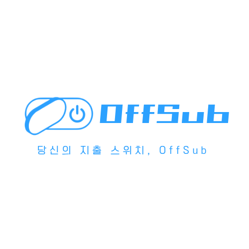
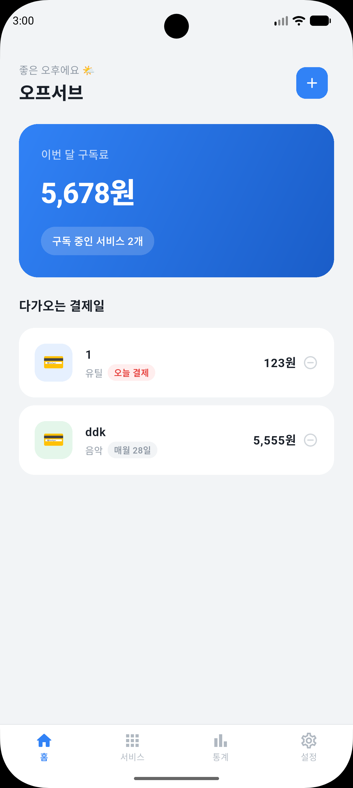

# OffSub (오프서브)
> **On-Device AI Subscription Management** > 사용자의 프라이버시를 최우선으로 생각하는 온디바이스 AI 기반 구독 관리 플랫폼

OffSub은 Android 16의 **Gemini Nano**를 활용하여 결제 내역과 앱 사용 시간을 로컬에서 분석하고, 서버 전송 없이 안전하고 스마트한 구독 해지 가이드를 제공합니다.


---

## 📸 Screen Shots

| 홈 화면 | 지출 통계 화면 |
| :---: | :---: |
|  |  |
| **구독 현황 및 소비 요약** | **구독 지출 통계 및 분석** |
| **서비스 관리 화면** | **설정 화면** |
|  |  |
| **구독 서비스 추가 및 해지 관리** | **온디바이스 AI 및 보안 설정** |

---

## ✨ 핵심 기능

* **🔒 Privacy First (Zero-Server)**
    * 모든 데이터 처리는 외부 서버 전송 없이 **기기 내부에서만 수행**됩니다.
* **🤖 On-Device AI Chat**
    * `Gemini Nano`를 통해 유출 걱정 없는 개인 맞춤형 구독 해지 및 소비 상담을 제공합니다.
* **🔔 Subscription Tracker**
    * `NotificationListenerService`를 기반으로 결제 알림을 감지하여 구독 정보를 자동 등록합니다.
* **📊 Usage Analysis**
    * `UsageStatsManager`를 통해 실제 앱 사용 시간을 분석하고, 돈만 나가고 있는 미사용 구독을 찾아냅니다.

---

## 🛠 기술 스택

### Frontend & Architecture
- **Framework:** Flutter (Dart)
- **State Management:** Provider
- **Design System:** Material 3, Pretendard Font

### Native & AI (Android Only)
- **Local AI:** Google Gemini Nano (`AICore`)
- **Native Bridge:** `MethodChannel` 
  - Android `UsageStats` (앱 사용량 데이터)
  - Android `NotificationListener` (결제 알림 데이터)

---

## 📂 프로젝트 구조

```text
lib/
├── models/          # 데이터 모델 (Subscription, Usage 등)
├── services/        # 네이티브 시스템 연동 로직 (MethodChannel, AI Bridge)
└── screens/         # UI 화면 구성
    ├── auth/        # 인증 및 로그인
    ├── onboarding/  # 온보딩 가이드
    ├── dashboard/   # 메인 대시보드
    └── chat/        # AI 챗봇 화면
